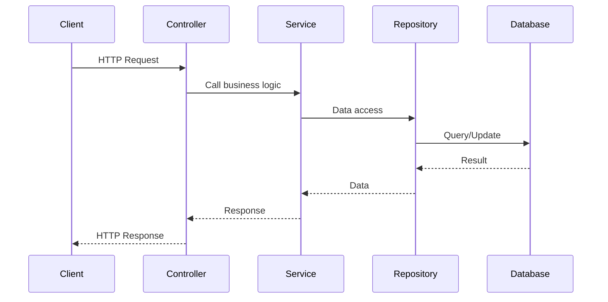

# Diagrams

## UML Class Diagram

*Insert UML diagram showing entities and relationships here.*

## Request Flow

## Layered Architecture

*Insert layered architecture diagram here.*

## Database Schema

*Insert ER diagram or table relationships here.*
